# 🔓 Hardware Hacking — Where Circuits Spill Secrets

What if you could steal data without touching the code? What if a tiny delay or a dip in power was enough to reveal a password?

Welcome to hardware hacking—where we don’t break into software, we tap into the signals flowing through the wires.

This repo is your launchpad into the world of side-channel attacks. We’ll start with the basics: how signals behave, what serial communication really looks like, and how information leaks through power usage and timing quirks.

You won’t need expensive gear or a hardware lab—just curiosity and a few lines of code. Through simple simulations, you’ll see how hardware, even when it’s doing everything “right”, can still leak secrets.

Ready to listen in on what the hardware is trying to hide?

Let’s begin.

---
<br>

Before we dive into the fun stuff, here’s a banger of a **[book](./resources/ebin.pub_the-hardware-hacking-handbook-breaking-embedded-security-with-hardware-attacks-1nbsped-159327.pdf)** to kickstart your hardware hacking journey.  
Think of it as your sidekick while you spy on power traces and interrogate unsuspecting microcontrollers.  
We'll only be exploring certain concepts from the book but feel free to explore other chapters if you want!  

> **Note**: Throughout this resource there are multiple companion python notebooks to help you simulate attacks and learn more effectively. To utilize these properly you'll need certain python libraries like ```chipwhisperer```, `matplotlib`, `numpy`, `tqdm`, `holoviews` and `bokeh`.  
> Please ensure these are installed before running the notebooks.


Now onto the fun stuff 😈.

---

## ⏱️ Timing Attacks

Timing attacks are sneakily simple ⏱️. You just watch how long a system takes to respond to different inputs—and voilà, you’re already gathering clues. Depending on the time taken, you might figure out whether the algorithm went down **path A** or **path B**. It’s like algorithmic detective work, but instead of a magnifying glass, you’re holding a stopwatch. Let’s see how this plays out with an example:
 

> Imagine a PIN checker that blinks a red LED when the password is wrong. Sounds innocent enough, right?  
> But if you measure how long it takes to respond, you might start noticing patterns—like which character it trips up on.  
> ⏰ A little timing can go a long way.  
>   
> Let’s check out a sample graph to see this in action:  
> 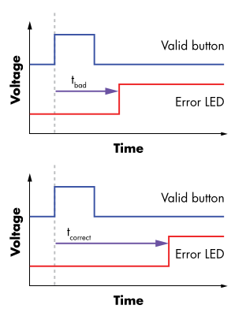
> <br>Take a look at the two graphs. In the first one, the error LED lights up *faster* than in the second. That means the system figured out something was wrong *sooner*.  
> 
> Let’s say the correct password is **WOMP**. The first graph might be from an input like **BOOP**, where the very first character is wrong—so the system bails out early. The second graph might be from something like **WONT**, where it gets through a few correct characters before tripping on the third one.  
>   
> Sneaky, right? Just by watching the clock, we’re already narrowing down the secret.
> <br>And here’s the real hack: instead of brute-forcing through ~5000 possible passwords, timing gives us clues that cut down the search space *big time*.  
> Now we’re looking at just around **40 guesses**. Way easier, way sneakier 😎.

---

Now let’s say someone got smart and added a little **random delay** before lighting up the error LED. The password check still works the same way under the hood, but now there’s a bit of noise in the timing.

That means the delay between pressing "verify" and seeing the error light no longer gives a clean hint about which character failed. Our trusty stopwatch? A little less trustworthy now.

So if timing alone can’t always give us the answers—especially with random delays muddying the waters—it’s time to shift our attention to something more subtle. Let’s see what the device might be revealing through its power consumption.

## ⚡ Simple Power Analysis (SPA)

Simple Power Analysis involves looking at how a device’s power consumption changes as it processes different inputs. It’s not just visual inspection—we might use basic operations like subtraction or filtering to highlight repeating patterns in the power trace.  
> **Power trace** is nothing but a graph of a device’s power consumption recorded over time while it performs a task.

These patterns can reveal things like which instructions are being run or even the data being handled, depending on how leaky the implementation is. It’s a surprisingly effective technique, especially when the device isn’t trying too hard to hide its secrets.  

Let’s look at how a sample power trace would appear for a microcontroller running a password checker algorithm. Here's the graph for a **single character**:

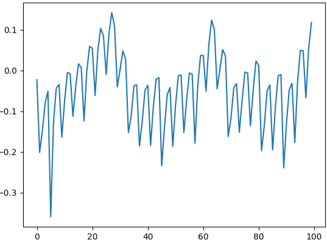

Well okay… that doesn’t really tell us much, does it?

Now let’s try plotting it for **all possible characters** in the first position of the password:

<div style="display: inline-block;">
  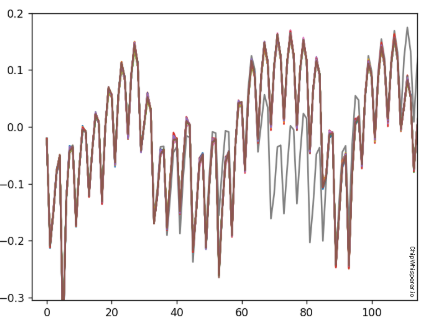
  <div style="text-align: center; width: 100%; font-size: 0.9em; color: gray;">
    <em>Power traces of Multiple Character Guesses in one plot</em>
  </div>
</div>

Wait, why does it look like there are only two graphs—**brown** and **gray**?

Turns out, it’s actually a bunch of traces plotted together. But since the power consumption for many characters is identical, their traces get **superimposed**, forming that collective *brown* shade.

So what can we learn from this?

> Since the trace for **one character** stands out from the rest, it must be the **correct character**.  
> **BINGO!**

Wait—before we pop the confetti, there’s a small catch.

The graphs we saw earlier were just tiny snapshots of the device’s power usage while checking one character. But in reality? The full power trace looks more like this:

<div style="display: inline-block;">
  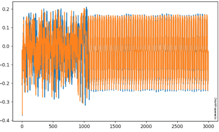
  <div style="text-align: center; width: 100%; font-size: 0.9em; color: gray;">
    <em>Full trace of two character guesses, orange and blue</em>
  </div>
</div>

Whoa. That looks nothing like the neat little plots we saw earlier—it’s on a completely different scale. So how do we find meaningful differences in this chaos?

Simple: **Subtraction.**

We subtract each power trace from a reference "wrong" power trace. This helps highlight the subtle differences in power consumption between correct and incorrect guesses.

But wait—what character can we always count on to be wrong?

Take a second to think about it...

<details>
  <summary><strong>Answer</strong></summary>

  ```0x00``` — the null byte. It's rarely ever the correct character in a password, so it’s a great baseline for comparison.

</details>

Once we subtract the reference wrong trace from all the others, we get a much clearer picture:

<div style="display: inline-block;">
  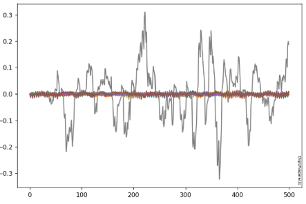
  <div style="text-align: center; width: 100%; font-size: 0.9em; color: gray;">
    <em>Power traces after subtraction with reference "wrong" trace</em>
  </div>
</div>

> Now it's much easier to spot the outlier — the **gray** trace.  
> That’s the correct character for this position in the password. Let’s go. We’re finally cracking passwords with simple power analysis.
 
 ---

> But it's not just password cracking, we can also apply it on multiple encryption algorithms like **ECDSA**, **RSA** etc. You can learn more abouut them in *Chapter 8* of the [book](./resources/ebin.pub_the-hardware-hacking-handbook-breaking-embedded-security-with-hardware-attacks-1nbsped-159327.pdf).  
> Here is a sample [Python implementation](./resources/HHH_08_Ive_Got_the_Power_Introduction_to_Power_Analysis.ipynb) of a full SPA attack on ECDSA algorithm. 

But can we find a case where **Simple Power Analysis** doesn’t work?

Absolutely. In fact, there are several—but one of the most common is when we're dealing with encryption algorithms where the variation in power consumption is very minute because it differs majorly with the data processed.

No branching, no obvious differences in power consumption.  
Tough break, right?

So how do we even begin to crack something like that?

We turn to a very important property of binary data: [**Hamming Weight**](https://en.wikipedia.org/wiki/Hamming_weight).  

Let’s take a look at the next type of power analysis that makes clever use of this idea—**Differential Power Analysis**.

## 📉 Differential Power Analysis

Sometimes the power traces don’t give away anything obvious—even though secrets are still leaking beneath the surface.  
This is where **Differential Power Analysis (DPA)** shines.  
Instead of relying on a single trace, DPA looks at a *bunch* of power traces—thousands, usually—and uses statistical techniques to find tiny differences between groups. These differences can leak information about the data being processed, even if the algorithm’s control flow doesn’t vary at all.  
It’s like picking up on a whisper in a crowd—not easy, but totally doable if you listen carefully (and run the right math).

Before we go on to the actual concepts of DPA, let's understand **Hamming Weight**.

---

### Hamming Weight

The **Hamming Weight** of a binary value is simply the number of bits that are set to 1. For example, the Hamming Weight of `0b1101` is 3.  
This concept becomes highly relevant in power analysis because many digital circuits—especially **CMOS-based** ones—consume power in proportion to the number of bits switching from 0 to 1 or vice versa.  
As a result, operations involving data with different Hamming Weights can leave behind subtle patterns in power consumption—patterns that, with the right approach, can reveal information about the data being processed.

> If you want to explore power consumption in CMOS circuits further, here is a great [resource](./resources/cmos_power_consumption.pdf).

> Here is a great [Python simulation](./resources/Lab%203_1%20-%20Large%20Hamming%20Weight%20Swings%20(MAIN).ipynb) showing the increase in power consumption with *Hamming Weight*.

---

### So, what encryption algorithm are we going to be working with?

One of the most widely studied and used algorithms is the **Advanced Encryption Standard**, or [AES](https://www.geeksforgeeks.org/computer-networks/advanced-encryption-standard-aes/).  
Also refer [here](https://en.wikipedia.org/wiki/Advanced_Encryption_Standard) for more info on AES and attacks on it.

It’s a symmetric encryption algorithm used practically everywhere: from securing Wi-Fi to encrypting files on your laptop.  
And yes, it's very much within the scope of DPA techniques.

So before we go further, let’s take a quick dive into how **AES encryption** works and where the potential leakage points are hiding.


### Advanced Encryption Standad (AES)

AES always operates in 16-byte blocks, which means that you must encrypt 16
bytes at a time. AES has three possibilities for key length: 128-bit (16 bytes),
192-bit (24 bytes), or 256-bit (32 bytes).  
Longer keys typically mean stronger
encryption, as any sort of brute-force attack takes exponentially longer to
crack for longer keys. We'll primarily work with **128-bit AES**.  
AES operates on a 4 × 4 column-major order array of 16 bytes `b0, b1, ..., b15` termed the state:
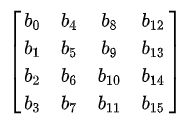
  
**Here is a high level high-level description of the algorithm**  
There are multiple rounds of encryption for an application of AES. Each round has a specific *round key* which is derived from the **AES key schedule**. Let's take a look at what one round generally consists of:

- `AddRoundKey` - each byte of the data input is combined with the corresponding byte of the round key using **bitwise XOR**.

- `SubBytes` - each byte is substituted by another byte. It is performed using a lookup table also called the **S-box**.


>  <div style="display: inline-block;">
>    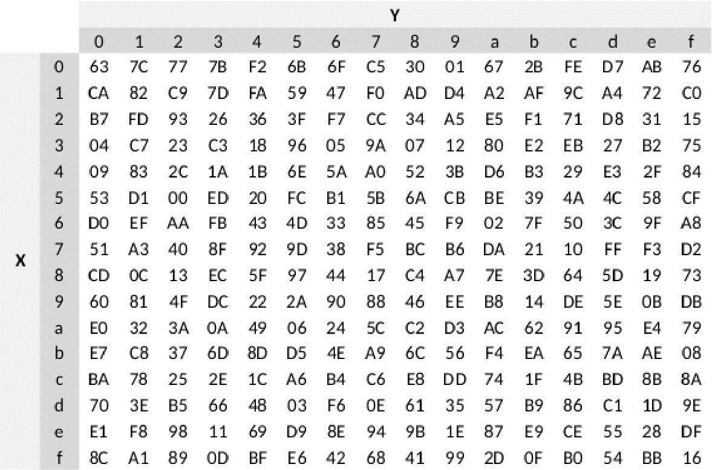
>    <div style="text-align: center; width: 100%; font-size: 0.9em; color: gray;">
>      <em>S-box generally used in AES encryption</em>
>    </div>
>  </div>  
> <br>

> Each byte is represented in hexadecimal and the corresponding digits/symbols are matched with the rows and columns to give us the output byte.  
> Ex: `0x3f` corresponds to `row 3` and `column f` which gives `0x75`
- `ShiftRows` - a transposition step where the last three rows of the state are shifted cyclically a certain number of steps.

- `MixColumns` - a linear mixing operation which operates on the columns of the state, combining the four bytes in each column.  

Since performing DPA on the entire round of encryption can get a bit complex we'll be focusing mainly on the first two steps - *AddRoundKey and SubBytes*.  
> If you do want to explore the full attack on AES, here is a great [paper](./resources/AESCounterAttackPaper.pdf).

So let's get on with our DPA attack. We'll focus on one byte of the 16-byte state. The same can be applied to all the bytes to get the full key.  

> Here is a [basic demo](./resources/Lab%203_2%20-%20Recovering%20Data%20from%20a%20Single%20Bit.ipynb) on how to recover a single bit of data from an internal state of an AES implementation.

---

The first step is to send random data to the device and observe the power consumption during the encryption process (typically the first couple of rounds).  
The captured data might look something like this:  

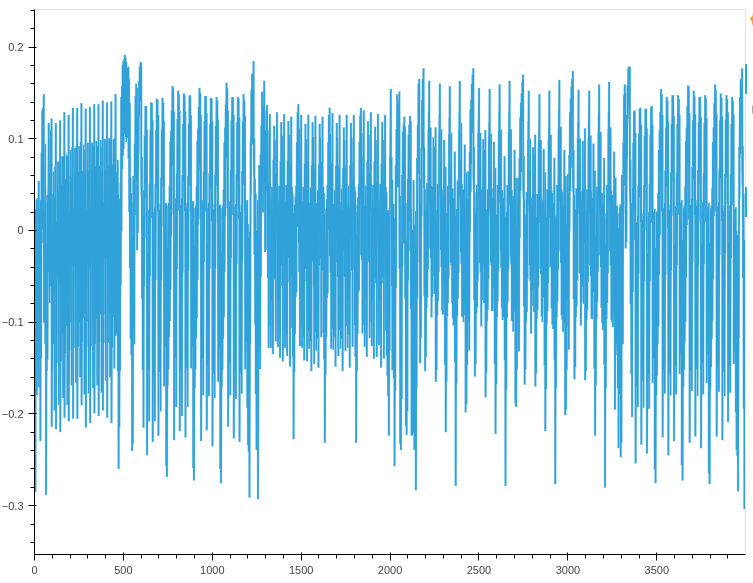

Now comes the fun part: how do we extract useful information from this mess of traces?

The core idea behind DPA is to split the collected power traces into two groups—based on the value of a specific bit in a *hypothetical* intermediate result. To start simple, we’ll focus on guessing just **one byte** of the AES key at a time.

For simulation purposes, we’ll define our own AES encryption function and compute the intermediate output using the same plaintext inputs, combined with our *guessed key byte*.

Since we're assuming that the power leakage is primarily influenced by a **specific bit** of that output byte, we’ll focus on that bit alone.

As we saw earlier, due to the CMOS nature of the hardware, processing a `1` tends to consume more power than processing a `0`.  
So, we split all the power traces into two groups:
- One where the selected bit is `1`
- One where the selected bit is `0`

Now, here's the catch:
- If our key guess is **correct**, the traces are split meaningfully based on the actual internal state, and there will be a measurable difference in the **average power consumption** between the two groups.
- But if the guess is **wrong**, the split is effectively random—and any difference in average power will be negligible.

This difference (or lack thereof) becomes our signal. We repeat this process for all 256 possible key byte values, and the one with the highest difference? That’s our likely key byte.  

Here’s a sample plot showing the difference between the average of the `"ones"` group and the `"zeroes"` group—for every possible key guess:  

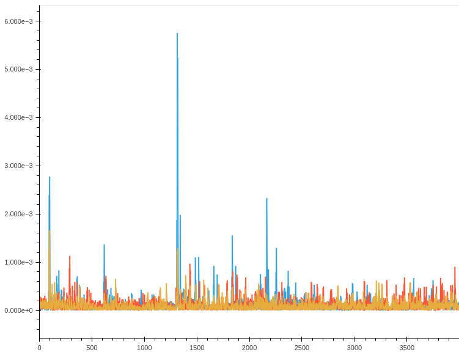

Most of the traces stay pretty flat, which means those guesses didn’t really split the power traces in any meaningful way.  
But the *blue* trace? That one clearly stands out, with some solid spikes at specific points in time.

This sharp difference is a strong sign that we’re on the right track—and when it comes to power, the numbers speak for themselves.  

> Here is a [Python Simulation]() for a DPA attack on an implementation of AES. The power traces are pre-recorded from our encrypting microcontroller.

---

But before we celebrate, there’s one small catch.  
Sometimes, this whole process doesn’t actually point us to the correct key. Instead, we get something a little sneakier—what we like to call **ghost peaks**.

These are misleading spikes in the graph that *look* like they’re pointing to the right key, but they’re just pretending. Sneaky, right? Below is an example of a plot with *ghost peak*.

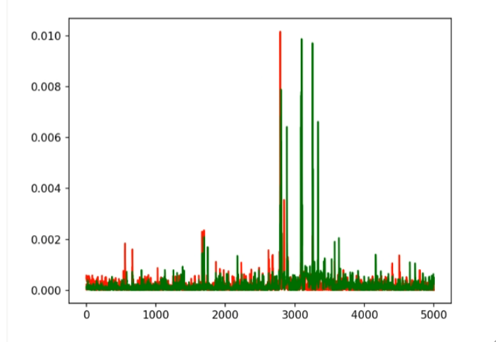  

As we can see, both the red and the green plot have pretty significant peaks. Well that poses an issue right we can't accurately guess which is the correct key guess. There are many causes for this like:

  - **Incorrect Target Byte** - maybe we made an error by looking at the wrong byte whereas the leakage is from a totally different byte/bit.

  - **Correlation leakage** - Even when our key guess is wrong, it can still accidentally line up with patterns in the real power consumption—just enough to cause a fake spike in the graph. This happens because certain wrong key guesses might still produce intermediate values that are *statistically similar* to the real one, especially when we look at just a single bit.  

  - **Signal misalignment** - happens when power traces don’t line up properly—small timing variations during measurement can shift the key moments in each trace.  
  As a result, when we average the groups, the real patterns get smeared out and random noise can show up as misleading spikes—aka ghost peaks.  

  - **Statistical coincidence** - it might just be a statistical coincidence arising due to, primarily, a low number of samples/traces.  

So how do we fix this?  
Some ways are:

- Increase the number of traces recorded
- Change the targetted bit and combine solutions from multiple bits
- Window the input data - look at only a particular part of the trace where you know (from examining a lot of traces) the processing of that bit is occurring.  

But all of these solutions are too time and resource consuming and are simply impractical when it comes to actual implementation. So how can we do better?  

Let's try out the same technique but this time we include the **hamming weight** concept we saw earlier.  

---

## Correlational Power Analysis

Alright, so we’ve seen how SPA and DPA do their thing—spotting patterns, splitting traces, and looking for obvious signs of the correct key.  
But sometimes, the traces don’t give away their secrets that easily. The differences are subtle, and averages just don’t cut it.  
That’s where **Correlational Power Analysis (CPA)** comes in.

Instead of just grouping and comparing, CPA uses a bit of brainpower. We take a guess at the key, figure out what the power consumption *should* look like based on that guess, and then see how closely it matches the actual trace.  
If the two line up well, we’re probably onto something. If not, we move on to the next guess—no hard feelings.

We saw earlier that **Hamming Weight** is just the number of ones in a binary number.  
Now here’s the cool part—there’s actually a pretty solid relationship between the Hamming weight of a byte and how much power gets used while processing it. And it’s not some vague trend—it’s **linear**!

> See this relationship in action with a [Python Simulation](./resources/Lab%204_1%20-%20Power%20and%20Hamming%20Weight%20Relationship%20(MAIN).ipynb).

Here’s a sample graph to show what that relationship might look like:

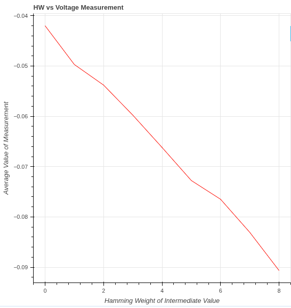

So how do we use this in practice? It’s a lot like what we did in DPA.  
We start by guessing a key, run it through our AES function, and get the *hypothetical output*. For each output byte, we calculate its Hamming weight and match it with the corresponding power trace we recorded.

Now we want to check if there's a nice clean relationship between the Hamming weights and the actual power used.  
To do that, we use something called the **Pearson correlation coefficient**—fancy name, but all it does is tell us how strongly two things are related.

If the numbers line up well, that’s a big clue that our key guess is probably on point.

The actual algorithm is as follows for datasets $X$ and $Y$ of length $N$, with means of $\bar{X}$ and $\bar{Y}$, respectively:

$$r = \frac{cov(X, Y)}{\sigma_X \sigma_Y}$$

$cov(X, Y)$ is the covariance of `X` and `Y` and can be calculated as follows:

$$cov(X, Y) = \sum_{n=1}^{N}[(Y_n - \bar{Y})(X_n - \bar{X})]$$

$\sigma_X$ and $\sigma_Y$ are the standard deviation of the two datasets. This value can be calculated with the following equation:

$$\sigma_X = \sqrt{\sum_{n=1}^{N}(X_n - \bar{X})^2}$$  

If $r$ is closer to one, it means that the two datasets are more linearly related. So in this case, $X$ is the actual power traces observed and $Y$ is the hamming weight data we got from our *hypothetical output*.  

So now we just calculate this coefficient for all the possible key guesses and whichever is the highest is most likely to be the correct key guess.

> There is actually a way to expand on this even further. So we can see above that we need to go through all the traces before we get the output of the pearson coefficient.  This isn't too bad for a short attack, for a much longer one (think 10k+ traces) we won't get any feedback from the attack until it's finished. Also, if we didn't capture enough traces for the attack, the entire analysis calculation needs to be repeated! Instead of using the original correlation equation, we can instead use an equivalent "online" version that can be easily updated with more traces:  
> $$r_{i,j} = \frac{D\sum_{d=1}^{D}h_{d,i}t_{d,j}-\sum_{d=1}^{D}h_{d,i}\sum_{d=1}^{D}t_{d,j}}{\sqrt{((\sum_{d=1}^Dh_{d,i})^2-D\sum_{d=1}^Dh_{d,i}^2)-((\sum_{d=1}^Dt_{d,j})^2-D\sum_{d=1}^Dh_{d,j}^2)}}$$  
> where,
>| **Equation** |  **Value**  | 
>|--------------|------------|
>|  d           | trace number |
>|  i           |subkey guess |
>| j |  sample point in trace |
>| h |  guess for power consumption | 
>| t | traces |  
> 
> You can find below a simulation of what it would be like to run the above algorithm to get our 16 byte key.
> <video controls src="./resources/cpa_video.mp4" title="CPA Simulation"></video>

> [Python Simulation](./resources/Lab%204_2%20-%20CPA%20on%20Firmware%20Implementation%20of%20AES%20(MAIN).ipynb) on CPA on firmware implementation of AES.

---

### This is just the beginning of your hardware hacking journey. Side-channel attacks like power analysis are only the first step. As you go deeper, techniques like fault injection open up a whole new world of possibilities—and take your hardware hacking game to the next level.


---

<p align="center">
  <sub>
    Made with ❤️ for Hardware Hackers<br>
    by <a href="https://erciitb.github.io/">ERC</a>
  </sub>
</p>


